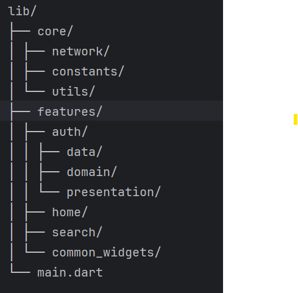
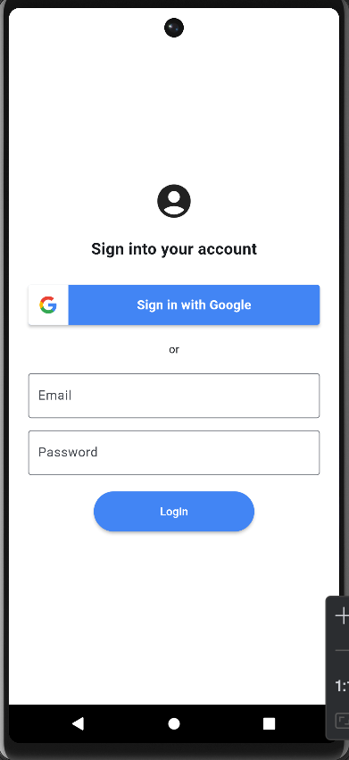
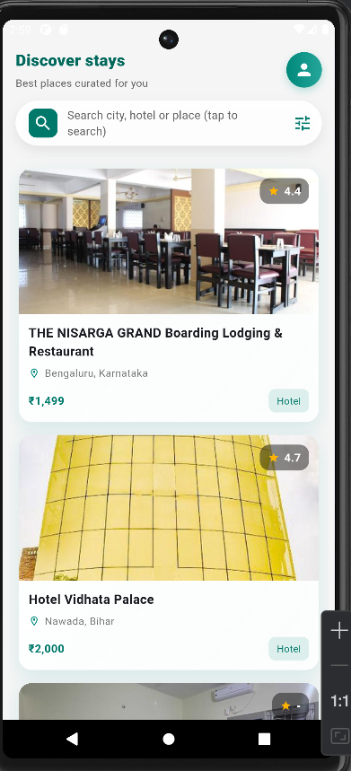
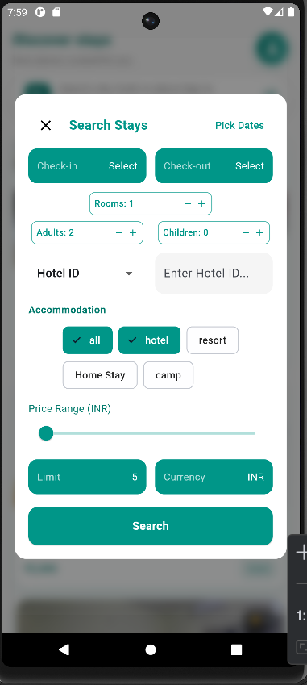
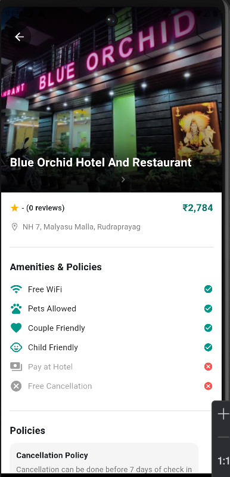

# 🌟 Hotel Search Flutter App

### 🚀 Overview

Hotel Search Flutter App is a modern, 3-page mobile application built with Flutter and BLoC architecture, designed to demonstrate clean code structure, state management, and API integration best practices.
It showcases Google Sign-In, hotel listings, and real-time search with pagination — all wrapped in a visually polished UI.

### ✨ Features

✅ Google Sign-In (Frontend)

Seamless Google authentication using google_sign_in
Mocked backend response for UI demonstration

✅ Hotel Listings

Modern UI with cards, images, and essential hotel details
Dummy data with pagination-ready structure

✅ Search Functionality

Integrated REST API-based hotel search
Supports pagination and real-time result updates

✅ Architecture & State Management

BLoC Pattern for predictable state handling
Clean Architecture separation: Data, Domain, and Presentation layers

✅ Responsive Design

Adaptive layouts for both Android & iOS
Built with Flutter’s Material 3 guidelines

### 🧩 Tech Stack
#### Category	Tools / Packages
#### Framework	Flutter 3.x
#### Language	Dart 3.x
#### State Management	flutter_bloc
#### Networking	http 
#### Architecture	Clean Architecture + BLoC
#### IDE	Android Studio / VS Code
#### Local Storage Hive (for saving user/session data locally)
#### Environment Variables: flutter_dotenv (for storing API keys and base URLs securely)

### 🔐 Environment Variables (.env)
#### BASE_URL	Base URL for API calls
#### AUTH_TOKEN	 Auth token

### 🏗️ Project Structure


### 🧠 Folder Explanation

#### core/ → Shared logic (networking, constants, utils)
#### features/ → Each app module with data, domain, presentation layers
#### common_widgets/ → Reusable custom UI components
#### main.dart → App entry point with route setup

### 🎯 Highlights

#### ⭐ Follows Clean Architecture Principles
#### ⭐ Organized and scalable folder structure
#### ⭐ Error handling and loading states integrated
#### ⭐ UI aligned with Material 3 guidelines
#### ⭐ Ready for backend integration

### 🖼️ Screenshots
# <p align="center">
#  
#  
#  
#  
# </p>


### ⚙️ Installation

1. Clone the repository:
   ```bash
   git clone https://github.com/anukeerthana123/hotel_search_flutter_app.git
   cd hotel_search_flutter_app

2. Move into the project directory:
   ```bash
   cd hotel_search_flutter_app

3. Get dependencies:
   ```bash
   flutter pub get

4. Run the app
   ```bash
   flutter run

### 🧪 Testing

1. Run all tests using:
   ```bash
   flutter test
